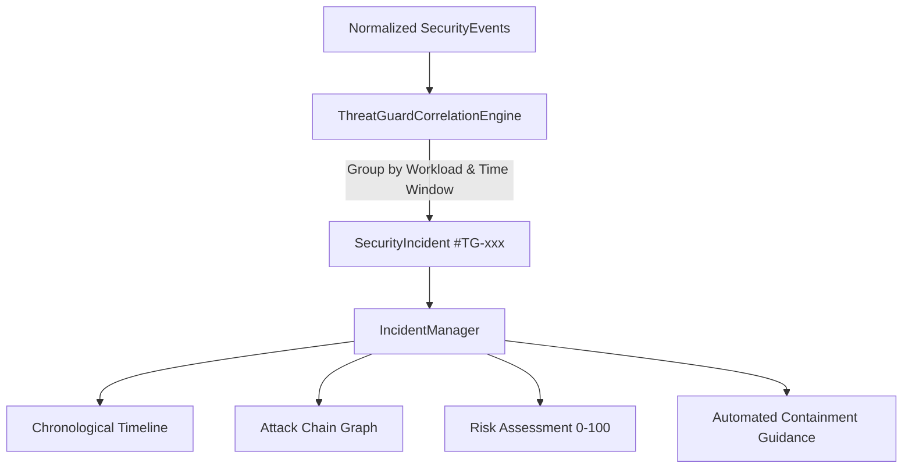

# ThreatGuard Security Incident Management & Response Guide

## 1. Overview
CloudNative ThreatGuard aggregates multi-stage runtime events, admission rejections, and network anomalies into unified security incidents (`#TG-xxxxxx`). Rather than overwhelming security operations teams with disconnected alert noise, the ThreatGuard **Incident Management Engine** maintains a stateful lifecycle, constructs an attack chain graph, measures composite workload risk, and generates actionable, non-destructive containment recommendations.



---

## 2. Incident Lifecycle States

Every correlated incident progresses through a structured SOC lifecycle:

| Status | Code | Description | Permitted Next States |
| :--- | :--- | :--- | :--- |
| **NEW** | `NEW` | Incident newly formulated by correlation engine; pending analyst review. | `TRIAGED`, `FALSE_POSITIVE` |
| **TRIAGED** | `TRIAGED` | Acknowledged by security analyst; initial severity and scope confirmed. | `INVESTIGATING`, `FALSE_POSITIVE` |
| **INVESTIGATING** | `INVESTIGATING` | Active digital forensics, process tree inspection, and network egress analysis underway. | `CONTAINED`, `RESOLVED`, `FALSE_POSITIVE` |
| **CONTAINED** | `CONTAINED` | Quarantine NetworkPolicy applied, pod cordoned, or service account tokens rotated. | `RESOLVED` |
| **RESOLVED** | `RESOLVED` | Threat mitigated, root cause identified, workload safely redeployed. | `CLOSED` |
| **FALSE_POSITIVE** | `FALSE_POSITIVE` | Verified as legitimate authorized activity or maintenance window; rule tuned. | `CLOSED` |

---

## 3. Incident Record Schema

```json
{
  "incident_id": "#TG-9F42A1",
  "title": "Multi-Stage Attack Chain Detected on payment-service-7f",
  "severity": "CRITICAL",
  "risk_score": 92.5,
  "risk_severity": "CRITICAL",
  "status": "NEW",
  "first_seen": "2026-09-05T12:00:00Z",
  "last_seen": "2026-09-05T12:02:15Z",
  "affected_cluster": "threatguard-local",
  "affected_namespace": "threatguard",
  "affected_pod": "payment-service-7f",
  "affected_container": "app",
  "affected_node": "threatguard-local-control-plane",
  "tactics": ["Execution", "Credential Access", "Command and Control"],
  "techniques": ["T1059.004", "T1552.007", "T1071"],
  "event_count": 3,
  "timeline": [
    { "step": 1, "action": "process_exec", "process": "/bin/sh", "tactic": "Execution" },
    { "step": 2, "action": "file_read", "process": "/bin/cat", "tactic": "Credential Access" },
    { "step": 3, "action": "net_connect", "process": "/usr/bin/curl", "tactic": "Command and Control" }
  ],
  "attack_chain": [
    { "step": 1, "tactic": "Execution", "technique": "T1059.004", "label": "Interactive Shell Spawned" },
    { "step": 2, "tactic": "Credential Access", "technique": "T1552.007", "label": "Service Account Token Access" },
    { "step": 3, "tactic": "Command and Control", "technique": "T1071", "label": "Outbound Connection to External Host" }
  ],
  "recommendations": [
    {
      "action": "ISOLATE_WORKLOAD",
      "title": "Isolate Compromised Pod payment-service-7f via NetworkPolicy",
      "priority": "HIGH"
    },
    {
      "action": "ROTATE_CREDENTIALS",
      "title": "Revoke & Rotate Exposed ServiceAccount Tokens",
      "priority": "CRITICAL"
    }
  ]
}
```

---

## 4. Remediation & Containment Workflows

ThreatGuard adheres to a **Recommend-First** architecture. No destructive actions (such as pod deletion or cluster mutations) are executed automatically without human approval.

Every generated command targets the Pod's actual owning controller (Deployment/StatefulSet/DaemonSet),
never the Pod's own unique instance name -- `reporting/workload_resolver.py` resolves this from
`ownerReferences` when available, optionally via a live, read-only `kubectl` lookup
(`threatguard remediate <id> --live-k8s`; see
[docs/security/kubernetes-ownership-rbac.md](../security/kubernetes-ownership-rbac.md) for the minimum
RBAC), or falls back to a documented naming-pattern heuristic. When none of those can confidently
determine ownership (a Job/CronJob-owned Pod, ambiguous owner data, or an unrecognized standalone Pod),
ThreatGuard emits a manual-remediation recommendation instead of guessing.

### Workflow 1: Workload Quarantine (Zero-Trust Isolation)
When an interactive shell or lateral movement probe is confirmed, apply an ingress/egress quarantine NetworkPolicy:
```bash
kubectl apply -f - <<EOF
apiVersion: networking.k8s.io/v1
kind: NetworkPolicy
metadata:
  name: quarantine-target-pod
  namespace: threatguard
spec:
  podSelector:
    matchLabels:
      app: threatguard-target-pod
  policyTypes:
  - Ingress
  - Egress
EOF
```

### Workflow 2: ServiceAccount Token Revocation
When credential access (`T1552.007`) is detected on `/var/run/secrets/kubernetes.io/serviceaccount/token`:
```bash
# Disable automountServiceAccountToken on the target deployment
kubectl patch deployment threatguard-target-pod -n threatguard -p '{"spec":{"template":{"spec":{"automountServiceAccountToken":false}}}}'
```

### Workflow 3: Forensic Log Capture & Safe Pod Termination
```bash
kubectl logs -n threatguard threatguard-target-pod > /tmp/target-pod-forensic.log
kubectl delete pod -n threatguard threatguard-target-pod --now
```
