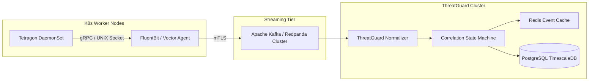

# CloudNative ThreatGuard — Production Migration & Scale Roadmap

This roadmap outlines the operational and architectural steps required to transition CloudNative ThreatGuard from a local single-node KIND cluster into an enterprise-grade, multi-cluster managed Kubernetes security platform (AWS EKS, Google Cloud GKE, Microsoft Azure AKS).

---

## 1. Managed Kubernetes Environments (EKS, GKE, AKS)

| Requirement | Local Prototype (KIND) | Enterprise Production (EKS / GKE / AKS) |
| :--- | :--- | :--- |
| **Control Plane Access** | Local containerized API server | Cloud-managed control plane with private endpoint access |
| **eBPF Kernel Compatibility** | Host kernel mapped via Docker mounts | Standard worker AMI with Linux 5.15+ (Amazon Linux 2023, Ubuntu LTS, COS) |
| **Admission High Availability** | 1 replica Gatekeeper controller | 3 replicas spread across failure domains with `failurePolicy: Fail` |
| **CNI & NetworkPolicy** | KIND default bridge CNI | Cilium CNI, AWS VPC CNI, Azure CNI powered by Cilium |
| **Identity & Access** | Local ServiceAccount tokens | Cloud IAM Workload Identity (IRSA / GCP Workload Identity / Entra ID) |

### Cloud-Specific Provisioning Considerations

#### Amazon Web Services (AWS EKS)
- **Node AMI**: Amazon Linux 2023 (`al2023-ami-kernel-6.1-*`) natively provides BTF support for Tetragon eBPF kprobes.
- **IRSA (IAM Roles for Service Accounts)**: Annotate ThreatGuard operator and remediation service accounts with AWS IAM roles granting least-privilege KMS and CloudWatch write access.
- **Security Groups for Pods**: Isolate the ThreatGuard controller pods from public load balancers.

#### Google Cloud (GKE)
- **GKE Dataplane V2**: Built directly on Cilium and eBPF. Tetragon TracingPolicies deploy cleanly to GKE nodes running Container-Optimized OS (COS).
- **GKE Workload Identity**: Eliminates static service account keys in favor of short-lived OIDC-federated GCP service account tokens.
- **Anthos Policy Controller**: Gatekeeper ConstraintTemplates can be synchronized natively via Google Config Sync.

#### Microsoft Azure (AKS)
- **Azure Linux / AKS Ubuntu**: Ensures kernel BTF debug symbols are present at `/sys/kernel/btf/vmlinux`.
- **Azure Workload Identity**: Integrates ThreatGuard with Microsoft Entra ID (formerly Azure AD).
- **Azure CNI Powered by Cilium**: Native high-performance eBPF data path.

---

## 2. Telemetry Ingestion: From JSON Logs to Real-Time eBPF Streams

In local mode, ThreatGuard ingests logs from Tetragon stdout export or simulation files. In production, this transitions to high-throughput streaming:



### 1. In-Kernel Filtering
- Utilize Tetragon's in-kernel namespace and binary filters to prevent kernel-to-userspace context switches for high-volume benign workloads.
- Filter out control plane heartbeats and standard kubelet health check probes before emitting telemetry.

### 2. High-Performance Sidecar Exporters
- Mount Tetragon's gRPC socket (`/var/run/tetragon/tetragon.sock`) directly to a Vector or FluentBit agent running on each node.
- Batch and compress events into protobuf or Snappy-compressed JSON lines.

---

## 3. Scaling the Correlation & Incident Engines

To handle clusters generating 50,000+ system call events per second:

```mermaid
graph TD
    A[Event Ingestion API] --> B[Apache Kafka Topic: security.events.raw]
    B --> C[Stream Normalization Workers]
    C --> D[Kafka Topic: security.events.normalized]
    D --> E[Stateful Correlation Cluster (Flink / Redis Streams)]
    E -->|Sliding Time Windows| F[Incident Formulation Engine]
    F --> G[(PostgreSQL Incident Store)]
    F --> H[Enterprise SIEM Exporters]
```

### Architecture Specifications
1. **Partitioning Strategy**: Partition events by `cluster_id / namespace / pod_name` to ensure all temporal events for a single workload land on the same stream processor partition.
2. **State Storage (Redis)**: Maintain active sliding windows (5m to 30m) in Redis sorted sets indexed by timestamp.
3. **Persistent Forensic Store (PostgreSQL + TimescaleDB)**:
   - Partition normalized events by day.
   - Retain correlated incidents and attack chains indefinitely with transactional integrity.

---

## 4. Enterprise SIEM & SOAR Integration

ThreatGuard exports normalized security events (`SecurityEvent` v2) and correlated incidents (`#TG-xxx`) to enterprise operations platforms:

### Splunk
- Forward via **Splunk HTTP Event Collector (HEC)** using the CIM (Common Information Model) mapping:
  - `mitre_technique` -> `technique_id`
  - `pod` -> `dest_host`
  - `severity` -> `vendor_severity`

### Elastic Security / SIEM
- Ship directly via **Elasticsearch Bulk API** using the **Elastic Common Schema (ECS)**:
  - `process.executable` = `event.process`
  - `orchestrator.cluster.name` = `cluster`
  - `orchestrator.namespace` = `namespace`

### Microsoft Sentinel
- Ingest via Azure Log Analytics Data Ingestion API.
- Correlate ThreatGuard incidents with Microsoft Defender for Cloud alerts.

### SOAR (Palo Alto Cortex XSOAR, Splunk SOAR, Tines)
- Webhook trigger on incident creation (`status: NEW`).
- Automatically invoke ThreatGuard CLI or API remediation dry-runs for analyst approval.
