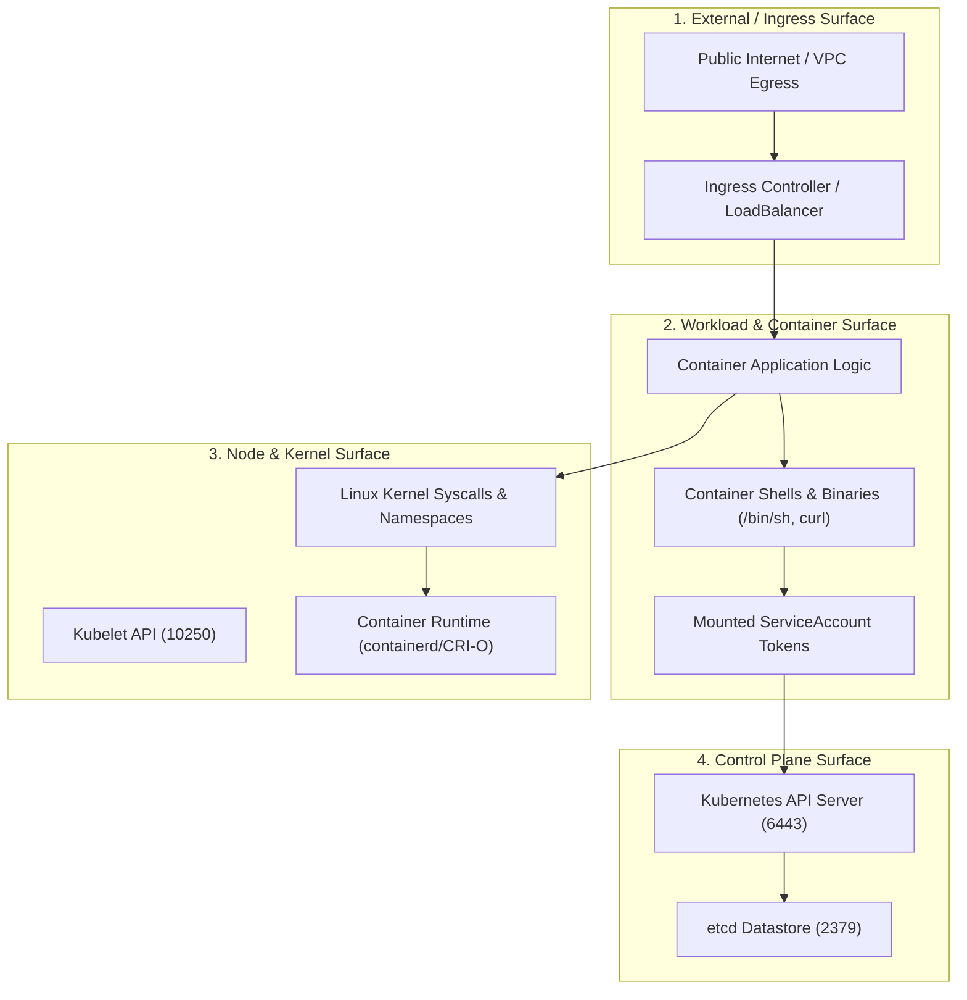

# CloudNative ThreatGuard — Threat Model & Risk Analysis

This threat model outlines the adversarial scenarios, potential attack paths, preventive controls, detective controls, and residual risks across the lifecycle of containerized workloads.

---

## 1. Threat Analysis Matrix

| Threat ID | Threat Description | Attack Path | Preventive Control (Gatekeeper) | Detective Control (eBPF Runtime) | Residual Risk |
| :--- | :--- | :--- | :--- | :--- | :--- |
| **THREAT-01** | **Insecure Developer Deployment** | Developer or CI pushes a manifest requesting `privileged: true`, `hostPID: true`, or root filesystem access. | **k8sprivilegedcontainer** & **k8shostnamespaces**: Admission webhook blocks the manifest before creation. | Cluster-level audit logs capture rejected admission requests. | Misconfigurations applied before Gatekeeper webhook initialization or in exempt namespaces. |
| **THREAT-02** | **Host Filesystem / Socket Hijack** | Workload mounts `/var/run/docker.sock` or host root `/` to take over the underlying node. | **k8shostfilesystem**: Blocks mounts matching node root or container runtime sockets. | eBPF monitoring of unauthorized `openat` and `mount` calls on the host node. | Zero-day vulnerabilities in container runtime mount handlers. |
| **THREAT-03** | **Container Privilege Escalation** | Attacker executes a setuid/setgid binary or uses capability manipulation (`capsh`, `nsenter`) to escalate to root. | **k8sprivilegeescalation** (`allowPrivilegeEscalation: false`) & **k8sdropcapabilities** (drop `ALL`). | **RUNTIME-005**: Tetragon traces `sys_enter_execve` for `capsh`, `nsenter`, and namespace unsharing. | Unpatched Linux kernel privilege escalation vulnerabilities (e.g., Dirty COW, Dirty Pipe). |
| **THREAT-04** | **Application RCE & Shell Access** | Vulnerability in web application (SQLi, deserialization, command injection) allows attacker to spawn an interactive shell. | Cannot be prevented at admission time (application code is valid YAML). | **RUNTIME-001**: Tetragon detects `sys_enter_execve` for `/bin/sh`, `/bin/bash`, `/bin/dash` and terminates the process. | Sub-millisecond execution before eBPF signal termination or in-process memory-only code injection. |
| **THREAT-05** | **Ingress Tool Transfer (Staging)** | Attacker uses `curl` or `wget` inside the container to download secondary exploitation scripts. | **k8sreadonlyrootfs**: Prohibits saving binaries to root filesystem; NetworkPolicy restricts outbound egress. | **RUNTIME-002**: Tetragon traces execution of network tools (`curl`, `wget`, `nc`, `socat`). | Tool functionality implemented directly using language libraries (e.g., native Python `urllib` / sockets). |
| **THREAT-06** | **Environment Reconnaissance** | Attacker runs `id`, `whoami`, `uname -a`, and `env` to fingerprint container and secrets. | Non-root enforcement ensures limited user permissions (UID 10001). | **RUNTIME-003**: Tetragon detects reconnaissance binaries and flags Discovery behavior. | Reading environment variables directly from `/proc/self/environ` without spawning binaries. |
| **THREAT-07** | **ServiceAccount Token Theft** | Attacker accesses `/var/run/secrets/kubernetes.io/serviceaccount/token` to authenticate to the Kubernetes API. | `automountServiceAccountToken: false` where practical. | **RUNTIME-004**: Tetragon monitors `security_file_open` on the token path and raises a Critical alert. | Memory scraping of tokens loaded in-memory by Kubernetes SDKs. |
| **THREAT-08** | **C2 & Lateral Movement** | Compromised container initiates unauthorized TCP connections to external IP or cluster services. | **Kubernetes NetworkPolicy**: Restricts pod egress to CoreDNS (port 53) only. | **RUNTIME-006**: Tetragon monitors `sys_enter_connect` to flag unauthorized egress attempts. | DNS tunneling or authorized communication channels to permitted endpoints. |

---

## 2. Threat Actor Profiles

| Persona | Motivation | Capabilities & Access Level | Primary Attack Vectors |
| :--- | :--- | :--- | :--- |
| **External Opportunistic Attacker** | Financial gain (cryptomining, extortion), botnet recruitment | No initial cluster access; scans exposed public endpoints (Ingress, NodePort) | Exploit CVEs in web services, RCE injection, automated shell-spawning exploits |
| **Compromised Developer / Insider** | Sabotage, data exfiltration, accidental misconfiguration | Valid Kubernetes credentials (`kubectl`), CI/CD pipeline access | Push overly permissive manifests (`privileged: true`, `hostPath: /`), bypass code review |
| **Advanced Persistent Threat (APT)** | Espionage, intellectual property theft, deep persistence | High sophistication, kernel exploit capabilities, living-off-the-land techniques | Kernel zero-days, container escape (`sys_admin`), token theft, lateral movement to control plane |

---

## 3. Kubernetes Attack Surface Analysis

The Kubernetes attack surface spans four distinct operational tiers:



1. **Ingress & External Network**: Public-facing workloads exposed via Ingress or NodePort. Subject to HTTP request smuggling, deserialization, and RCE.
2. **Workload & Container Runtime**: Execution environment within pods. Threats include interactive shells, utility abuse (`curl`, `nc`), token theft from `/var/run/secrets`, and local privilege escalation.
3. **Node & Host Operating System**: Shared Linux kernel, container runtime sockets (`containerd.sock`), and host filesystems (`/etc`, `/proc`, `/sys`). Breakout threats leverage `hostPID`, `hostPath`, or missing AppArmor/Seccomp.
4. **Control Plane & API Server**: The central orchestrator. Compromised workloads attempt to query `/api/v1` to enumerate secrets, create cluster roles, or launch privileged workloads on other nodes.

---

## 4. Trust Boundaries

```
[ External Untrusted Networks ]
             │  (Internet / External APIs)
═════════════▼══════════════════════════════════════════════════════ [ Boundary 1: Network Ingress ]
[ Workload Pod: App Container ]  <─── Shared Namespace Pod Context
             │  (Local syscalls / execve / file reads)
═════════════▼══════════════════════════════════════════════════════ [ Boundary 2: Container Isolation ]
[ Node Host OS & Kernel ]       <─── eBPF kprobes attach here
             │  (Kubelet / API traffic)
═════════════▼══════════════════════════════════════════════════════ [ Boundary 3: Cluster Control Plane ]
[ Kubernetes API Server & etcd ]
```

- **Trust Boundary 1 (Network Ingress)**: Boundary between untrusted clients and container endpoints. Guarded by NetworkPolicies and ingress security controls.
- **Trust Boundary 2 (Container / Node Isolation)**: Boundary between containerized cgroups/namespaces and the underlying host kernel. Guarded by OPA Gatekeeper (admission) and Tetragon (runtime).
- **Trust Boundary 3 (Workload / Control Plane)**: Boundary between workload pods and the Kubernetes API server. Guarded by RBAC, disabled token automounting, and network isolation.

---

## 5. Mitigations Mapped to ThreatGuard Components

| Threat Surface | Threat Scenario | ThreatGuard Component | Specific Mitigation / Rule |
| :--- | :--- | :--- | :--- |
| **Admission** | Privileged container requested in YAML | OPA Gatekeeper | `k8sprivilegedcontainer`: Rejects manifest before pod schedule |
| **Admission** | Container mounts `/` or `/var/run/docker.sock` | OPA Gatekeeper | `k8shostfilesystem`: Rejects host path mounts |
| **Admission** | Process requests `allowPrivilegeEscalation: true` | OPA Gatekeeper | `k8sprivilegeescalation`: Blocks root escalation permission |
| **Runtime** | Attacker spawns `/bin/sh` or `/bin/bash` | Tetragon + Detection Registry | `RULE-K8S-001`: Traces `sys_enter_execve`, flags interactive shell |
| **Runtime** | Attacker executes `curl` or `wget` to stage payload | Tetragon + Detection Registry | `RULE-K8S-002`: Traces utility execution, alerts on network tool |
| **Runtime** | Attacker runs `whoami`, `id`, `uname` | Tetragon + Detection Registry | `RULE-K8S-003`: Identifies discovery / system fingerprinting |
| **Runtime** | Reading `/var/run/secrets/.../token` | Tetragon + Detection Registry | `RULE-K8S-004`: Monitors `security_file_open`, alerts on credential access |
| **Runtime** | Execution of `capsh` or `nsenter` | Tetragon + Detection Registry | `RULE-K8S-005`: Alerts on capability manipulation / privilege escalation |
| **Runtime** | Outbound TCP beacon to unauthorized IP | Tetragon + Detection Registry | `RULE-K8S-006`: Flags unauthorized egress connections via `sys_enter_connect` |
| **Incident** | Multi-stage killchain across workload | Correlation Engine | Aggregates events into single `#TG-xxx` incident record with Mermaid attack graph |
| **Response** | Active breach containment required | Response Recommender | Generates non-destructive quarantine `NetworkPolicy` and token rotation commands |

---

## 6. STRIDE Threat Categorization

- **Spoofing**: Impersonation of cluster identities via stolen ServiceAccount tokens (**THREAT-07**).
- **Tampering**: Modifying binaries or configuration files on the container root filesystem (**THREAT-05**).
- **Repudiation**: Undetected malicious process execution inside approved containers (**THREAT-04**, **THREAT-06**).
- **Information Disclosure**: Exposing host files, kernel memory, or container tokens (**THREAT-02**, **THREAT-07**).
- **Denial of Service**: CPU/memory starvation or network interface flooding mitigated via resource limits and hostNetwork prohibition.
- **Elevation of Privilege**: Container breakouts and root user escalation (**THREAT-01**, **THREAT-03**).
